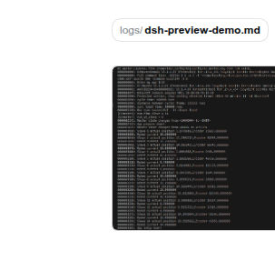

[English](README.en.md) | 中文

# dsh-plugins

面向 [DeepSeek Harness](https://github.com/deepseek-ai/deepseek-harness)（`dsh`）Web GUI 的两个体外插件（out-of-tree plugin），外加安装工具，以及那些让第三方插件得以成立的说明。

它们都是纯 JavaScript：**没有构建步骤，不用 `node_modules`，也不 fork 本体。** 每个插件都是一个包，由宿主端和浏览器端两部分组成，两部分都直接从它们在磁盘上的位置加载。

| 插件 | 作用 |
|---|---|
| [`image-paths`](image-paths/README.md) | 聊天消息里写下的图片路径会直接在该消息下方渲染成图片本身——不需要提交附件，也不写会话日志。 |
| [`markdown-preview`](markdown-preview/README.md) | 会话旁的 Markdown 预览抽屉：使用外壳自带的渲染器（TeX/KaTeX、代码高亮、表格、任务列表、脚注），并显示文档中的本地图片，跟随会话当前讨论的那个 `.md` 文件。 |

两者都是在运行中的 `dsh web`（profile 为 `web`）上构建并验证的，包括无需重启服务器即可热激活。

## 效果

消息里提到 `.md`，下面就会出现一行可点的文件 chip（目录灰色、文件名加粗）；工作区里真实存在的图片路径，会直接渲染成图片：



点 chip（或用 `?preview=` 链接）即在右侧面板渲染，用的是 shell 自带的 Markdown 渲染器，公式、代码高亮、表格、脚注都和聊天里一致，文档自身的本地图片也一起显示：


两张图都截自真实运行的 GUI：演示文档是工作区里的 `logs/dsh-preview-demo.md`，图片是仓库里已有的 `images/ecmaster-zero.png`。

## 安装

```sh
git clone https://github.com/<you>/dsh-plugins
cd dsh-plugins
./install.sh              # copy into ~/.dsh/plugins and register the profile rows
# or ./install.sh --link  # symlink instead, so edits in this repo are live
```

然后**重新加载一次 GUI 页面**：profile patch 一发生变化，宿主端就会挂载，但浏览器端属于页面的模块图，因此要靠重新加载才会载入（或卸载）它们。

`./install.sh --uninstall` 会删除插件目录和它写入的那些行，把 patch 层恢复为 `[]`（或你自己的条目）。

该脚本是幂等的，并且**原子地**替换 patch 文件——运行中的服务器会监视这个文件，并拒绝写入不完整的 patch，所以直接就地编辑可能让插件处于半注册状态。

### 另一种安装方式

每个插件还声明了 `dsh.bundle`，因此也可以按官方支持的方式作为 profile 层安装：

```sh
dsh plugin --profile web add /path/to/dsh-plugins/image-paths
```

这种方式在分发时更干净，但它写入的是 `dsh.profile.bundles`，而该处只在启动时读取——所以需要重启 `dsh web`；而 `install.sh` 是实时生效的。同一个插件不要两种方式同时用：同一个包名有两个活跃的 Loader 来源会报错。

## 有插件市场吗？

**没有。** `dsh` 里没有注册表、商店或插件索引——没有 `dsh plugin search`，没有目录页面，仓库文档里除了一篇“打包并安装插件”的教程也没有别的内容。分发模型是这样的：

| 单元 | 声明什么 | 由谁安装 |
|---|---|---|
| 普通包 | 没什么特别的——就是一个供其他插件 import 的库 | `dsh plugin --profile <p> add <spec>`（一个 pnpm 转发器） |
| **bundle** | `dsh.bundle.patch` → 它自己的 `cordis.patch.yml` 层 | `dsh plugin … add <spec>`，同时会把它追加到 `dsh.profile.bundles` |
| **client plugin row** | `dsh.client` + 一个 `exports["./client"]` bundle | 任何已启用的 Loader 行，只要该行的 specifier 能解析到 |

`<spec>` 可以是 pnpm 接受的任何东西——注册表包名、git URL、tarball、本地路径。所以今天“发布”一个插件，就是把包放到 pnpm 能取到的地方（npm，或者像本仓库这样的 git 仓库），再告诉别人该添加哪一行。因此本仓库只是一个“你可以从中安装的 git 仓库”意义上的市场。

## 体外插件为什么能工作

下面这些要点是本仓库摸索出来的；也正是它们决定了这里的插件为什么长成现在这个样子。

**打包。** 每个插件一个包，`type: module`，`exports` 提供 `"."`（宿主端）和 `"./client"`（浏览器端），还有一份 `dsh.client` manifest 声明 `platform: "web"`。本体会解析该行的 specifier，向上找到最近的 `package.json`，并把这个包的 `./client` 文件提供给浏览器。行的 specifier 可以是 `file://` URL，正因如此，插件才能从任何 `node_modules` 都不知道的目录里加载。

**浏览器端 bundle 的格式。** 外壳不会运行你的 TypeScript；它加载的是一个 CJS 工厂函数，外面包着模块加载器的握手协议：

```js
window.__ModuleLoader__.load({ id: '<package name>', factory: (require) => {
  var module = { exports: {} }; var exports = module.exports
  // ... bundle body; require() resolves against the shell's frozen module table
  return module.exports
} })
```

模块表只预置了 `react`、`react/jsx-runtime`、`react-dom`、`react-dom/client`、`@deepseek-ai/cordis`、`@deepseek-ai/dsh-client-store`、`@deepseek-ai/dsh-client-ui-slots` 和 `@deepseek-ai/dsh-client-ui-primitives`——所以手写的 bundle 无需任何构建流水线，就能使用 React、store、slot 注册表和 UI 原语（包括 Markdown 渲染器）。除此之外的东西都必须内联，或者通过 Cordis 服务获取。

**插件 UI 能出现在哪里。** 对第三方行来说，可用的席位就是外壳发布的那些 slot：`conversation.chat.node`（为你自己的 Conversation 节点类型提供的按键渲染器）、`conversation.session.header.utilities` 和 `…header.actions`（会话作用域的列表席位）、`shell.overlay`（frame 的 overlay 层里一个根作用域的列表席位——侧边面板或抽屉应该用这个），再加上 tool/attachment/settings 这几个席位。会话的 `details` 列和侧边栏各自只能有一个占用者，所以插件无法在那里加标签页。

**实时激活。** 带 `patchReload: live` 的 profile（随外壳发布的 `web` profile 就是）会监视它的用户 patch 层并重新组装，无需重启，因此添加到 `~/.dsh/profiles/web/cordis.patch.yml` 的一行会在一秒内挂载。浏览器端仍然需要刷新页面——HMR 接收器有意忽略模块图变化，因为启动时的模块图是初始加载的记录。编辑*已经加载*的 `lib/client.js` 则不同：宿主端会 stat 轮询所服务的 bundle 并推送一个 rebuild 帧，因此这种修改完全不用刷新就能热替换。

**宿主端不是热的。** Node 按 URL 缓存 ES 模块，所以用相同 specifier 重新应用同一行会复用它已经导入过的那个模块——改动过的 `index.js` 需要一个新的 URL（在行上加 `?v=` 查询参数，由同一个 patch 监视器应用），或者重启服务器。两个插件的 README 都写明了这一点。

**读取文件，而不另造新的接缝。** 有两种看起来诱人的做法对第三方插件行不通，值得在你动手尝试之前先了解：

- *附件。* 浏览器只能通过**被会话事件引用**的附件来读取图片字节，而提供该附件的 endpoint 会到会话日志里核对该引用。
- *你自己的会话事件。* 追加自定义事件类型会让会话日志无法读取：持久化读取路径会拒绝本体已知词汇表之外的任何类型，除非写入方把它标记为 `ignorable: true`，而 `Session.append` 无法设置该标记。它会在下次加载时把日志毒化。

所以两个插件都通过宿主端注册的一个小型只读 HTTP 路由（`ctx.webServer.register`）来提供字节，并在客户端根据日志里已有的消息完成渲染。这样会话格式保持不变，而且对历史记录也能追溯生效。这些路由执行同一套防护：只允许 loopback 的 `Host`、对浏览器调用方要求同源、真实路径必须位于调用方工作区内、扩展名白名单、magic byte 一致，以及大小上限。

## 环境要求

- 一份可以修改其 web profile 的 `dsh` 安装（`~/.dsh/profiles/web`）。
- Web GUI 通过 loopback 访问（两个插件都会拒绝非 loopback 的 `Host` 头和跨站请求；如果要部署在局域网上，必须在各自的 `index.js` 里放宽 `loopbackHost`）。
- Node 22+，用于运行测试。

## 测试

每个插件都附带一个 `test.mjs`，不需要本体、不需要浏览器，也不需要网络：

```sh
node image-paths/test.mjs
node markdown-preview/test.mjs
```

它们用一个 React 桩和打桩的 `fetch`，让浏览器端走真实的 `__ModuleLoader__.load` 握手；宿主端则针对真实的临时文件运行——包括各种拒绝场景（父目录穿越、符号链接逃逸、跨站、DNS rebinding、非图片字节、超大文件……）。

## 许可证

目前还没有 license 文件——代码归你，随你按自己的意愿授权。它所面向的本体是 MIT。
